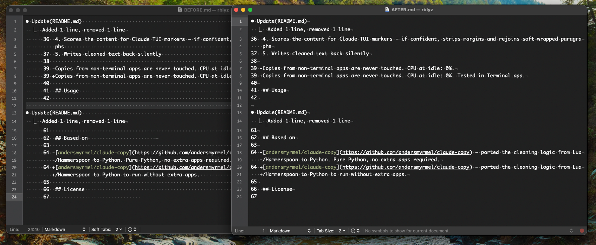

# Claude Code Clean Copy for Terminal

Clean copy from Claude Code's terminal. No junk, no reformatting, no extra apps.



When you copy from Claude Code's TUI you get rendering artifacts — box-drawing pipes (`│ ╭ ╰ ─`), trailing terminal padding, indented diff blocks, and sometimes whole multi-line plan boxes collapsed into one long line. Claude Copy intercepts Cmd+C in terminal apps and silently cleans the clipboard before you paste anywhere else.

## Install

### Use the pre-built app

```bash
git clone https://github.com/rblyz/claude-copy.git
cd claude-copy
./install.sh
```

### Build from source

```bash
git clone https://github.com/rblyz/claude-copy.git
cd claude-copy
pip3 install pyinstaller -r requirements.txt
python3 -m PyInstaller claude-copy.spec --noconfirm
./install.sh
```

### After install

Grant **Accessibility** access (needed to read Cmd+C). The installer prints the exact path:

`System Settings → Privacy & Security → Accessibility → + → choose dist/Claude Copy.app`

The app then auto-registers in **System Settings → General → Login Items → App Background Activity**, so it runs at every login.

## What it does

Four-step pipeline, runs on every clipboard copy from a terminal. No modes, no heuristics, no surprises.

| Step | What | Example |
|------|------|---------|
| `strip_box_drawing` | Removes `╭ ╰ ╮ ╯ ─ ╌ ╍ ═ │` characters; drops pure-border lines | `│ Hello │  ` → `Hello` |
| `rstrip` | Strips trailing whitespace from every line | `text···········` → `text` |
| `dedent_line_number_block` | Removes uniform leading indent from line-numbered diff blocks | `····42 +  foo()` → `42 +  foo()` |
| `recover_numbered_block` | Splits flattened "1 const ... 2 let ..." lines back into separate lines | `1 const a 2 let b` → `1 const a` / `2 let b` |

Anything else passes through untouched — code blocks, bullet lists, headings, blank lines, plain text from other apps.

## How it works

1. Listens for plain Cmd+C while a terminal app is focused (Ghostty, iTerm2, Terminal, Alacritty, kitty, WezTerm, Warp, and more).
2. Re-issues the Cmd+C, waits up to 350 ms for the clipboard to change.
3. Runs the four-step pipeline.
4. Writes the cleaned text back silently.

Copies from non-terminal apps are never touched. CPU at idle: 0%. Runs as a native macOS app (not Python at runtime).

## Usage

```bash
# stop
launchctl bootout gui/$(id -u)/com.claude-copy

# start
launchctl bootstrap gui/$(id -u) ~/Library/LaunchAgents/com.claude-copy.plist

# logs
tail -f /tmp/claude-copy.log

# uninstall
./uninstall.sh
```

If Accessibility access ever gets dropped (e.g. after rebuilding from source), the app shows a system notification and opens the right Settings pane automatically.

## Requirements

- macOS (Sequoia tested)
- Python 3 (only if building from source)

## License

MIT
